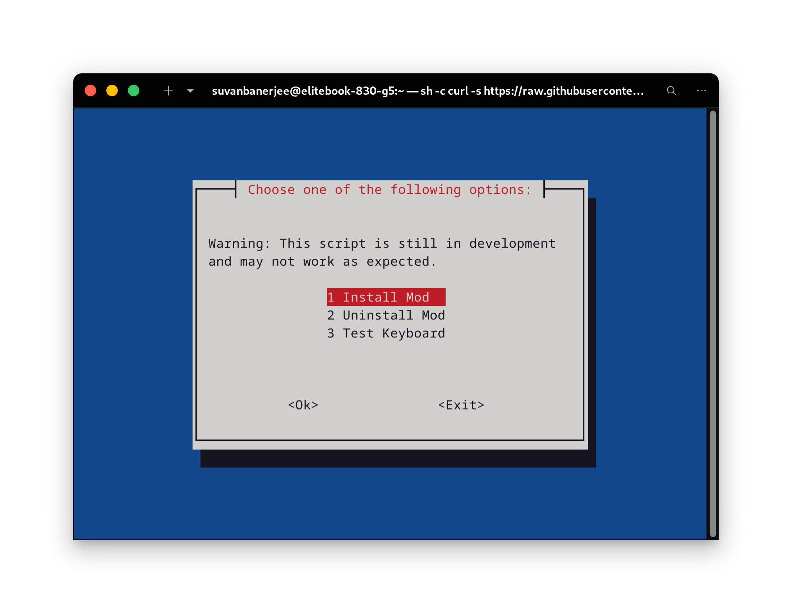
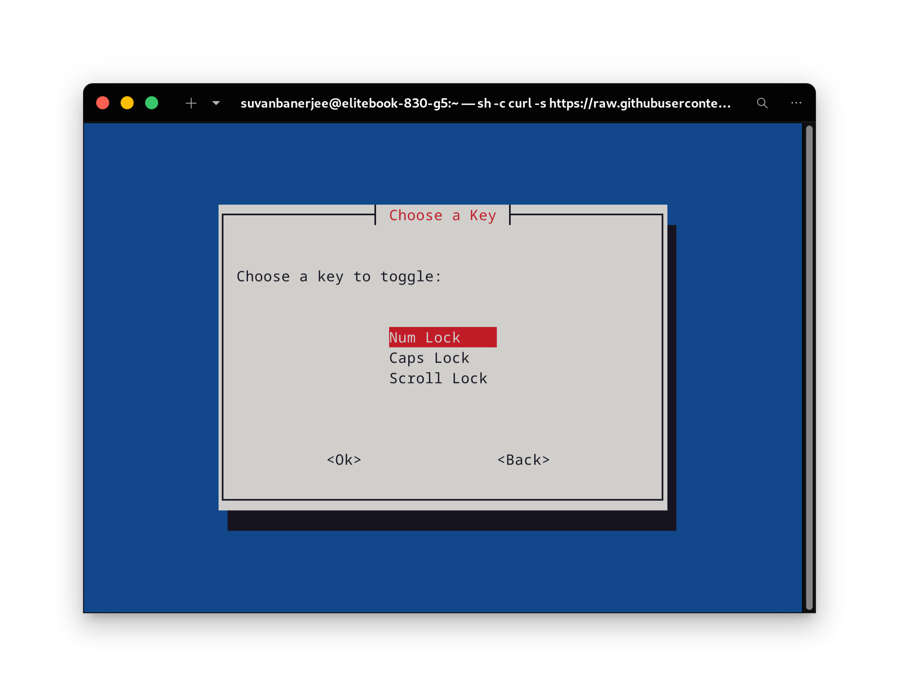
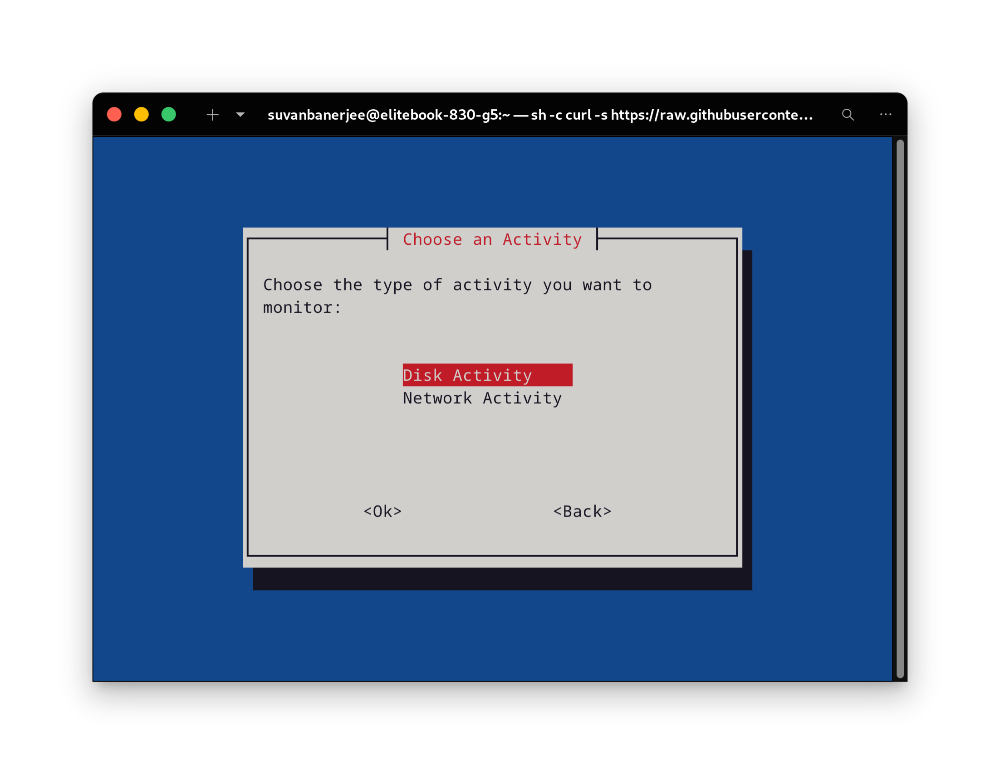
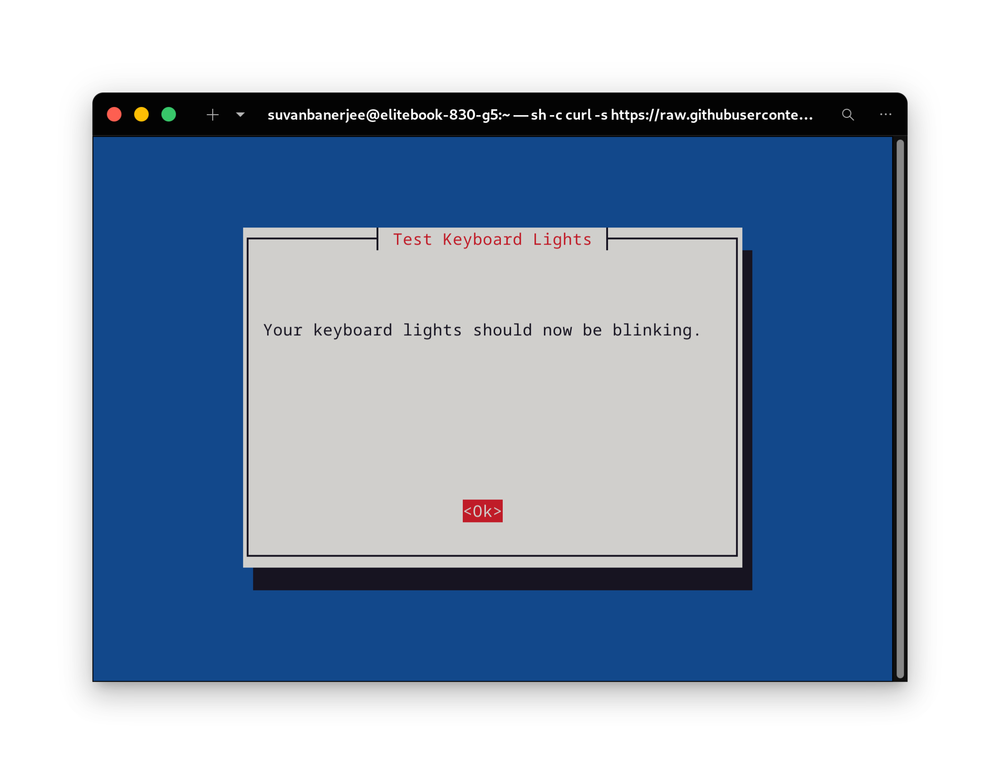

# Keyboard LED Remapper

Apart from the CAPS LOCK, the NUM LOCK, and the SCROLL LOCK on your keyboard are not used for anything meaningful. This project aims to change that by allowing you to use these LEDs as indicators for various system events, such as Disk Activity, Network Activity, CPU Usage, etc.

## Description

This project is my first GitHub project. It used to be a simple shell script that I ran on my computer to use the Scroll Lock LED as the Disk Activity LED. But now, after 2 years of learning programming, I have decided to make it better. Now, it is a TUI installer that can apply the earlier mentioned functionality to your computer, with the bonus of choosing any light on your keyboard and some other cool functions to choose from. It works on both Wayland and X11.

## Requirements

- Python
- Newt-whiptail (for the TUI)

## Legacy Version
The original shell script is still available in the legacy branch. you can find it [here](https://github.com/suvanbanerjee/keyboard-led-remapper/tree/legacy)

## Getting Started

Just copy and paste in terminal DONE!

```bash
sh -c "curl -s https://raw.githubusercontent.com/suvanbanerjee/Keyboard-LED-Remapper/main/installer.sh -o installer.sh && chmod +x installer.sh && sudo ./installer.sh && rm installer.sh"
```

## Screenshots







## 👥 Author

[Suvan Banerjee](https://github.com/suvanbanerjee)

## License

This project is licensed under the Unlicense - see the [LICENSE](https://github.com/suvanbanerjee/Keyboard-LED-Remapper/blob/main/LICENSE) file for details